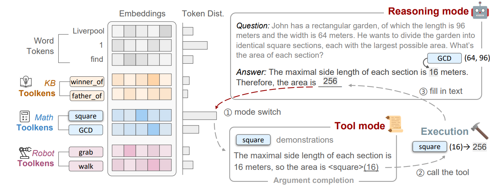

# ToolkenGPT
Source code for [ToolkenGPT: Augmenting Frozen Language Models with Massive Tools via Tool Embeddings](https://arxiv.org/abs/2305.11554)

## Requirements
+ Our experiments are conducted with LLaMA-13B/33B, which takes at least 2/4 GPUs of 24GB memory each.
+ All required packages for [LLaMA official repo](https://github.com/facebookresearch/llama).

## Getting Started
We are cleaning the code and will update the repo soon! Please stay tuned.